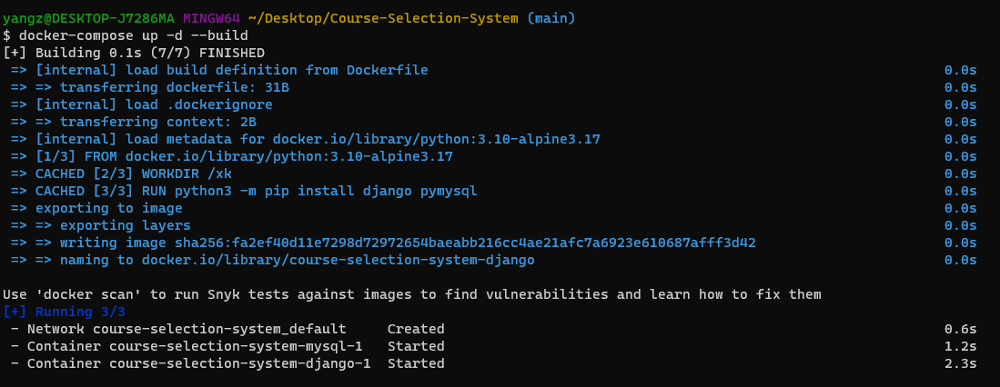
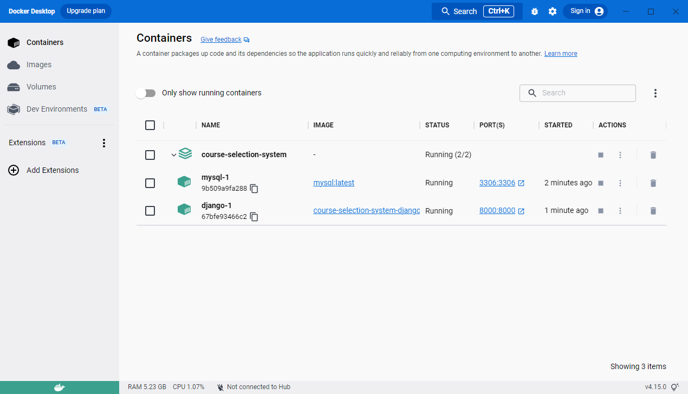
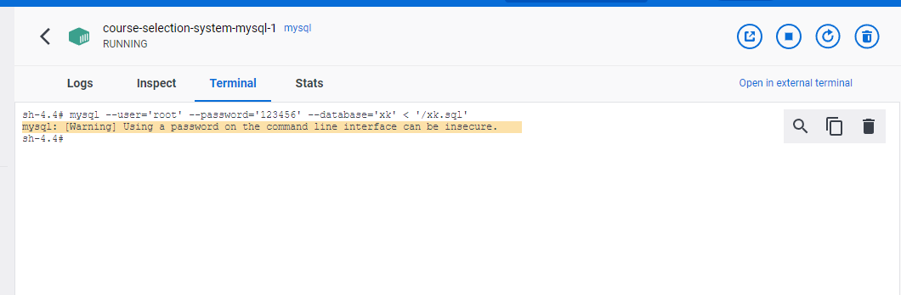
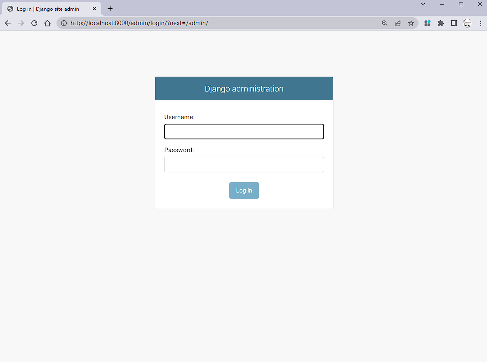
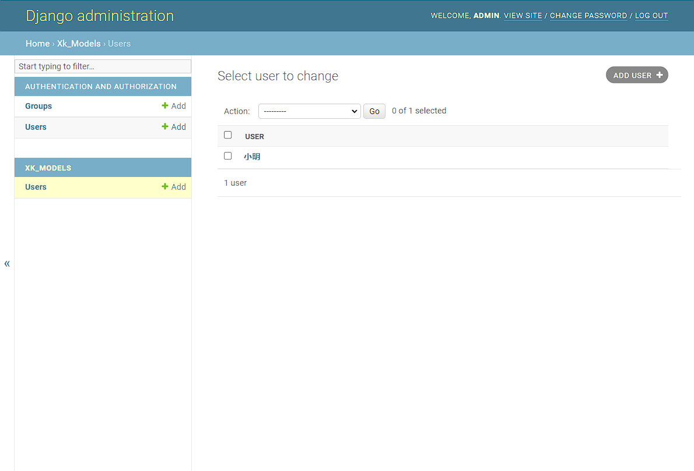
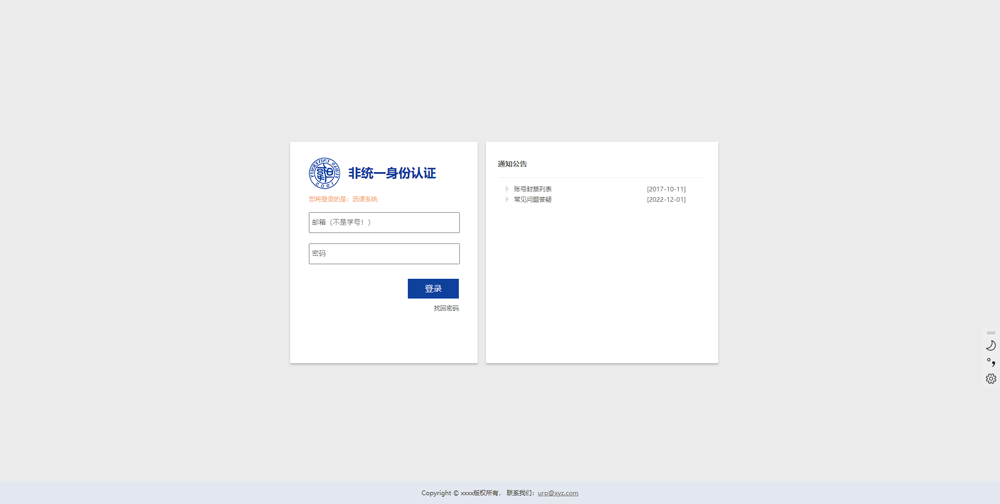
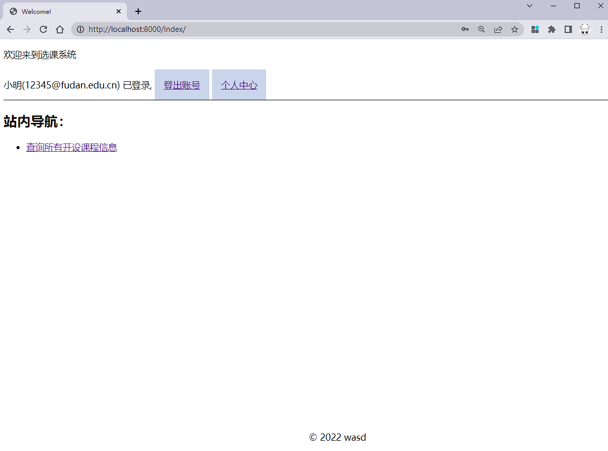
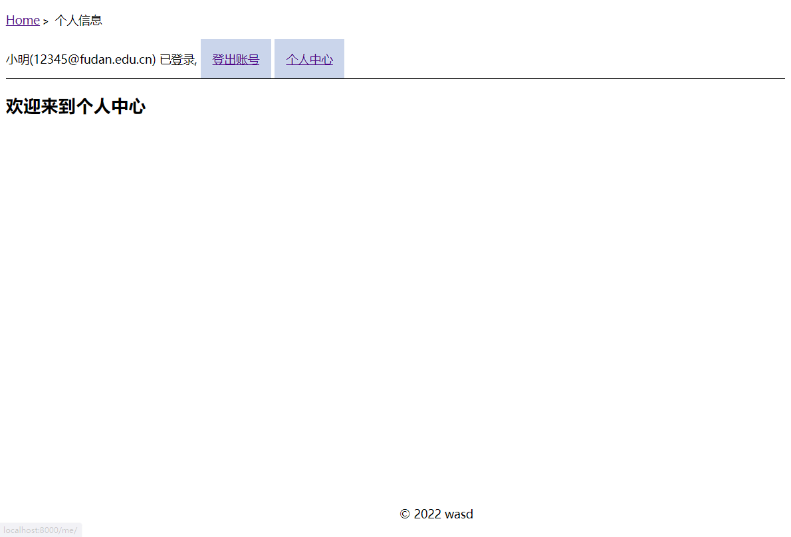
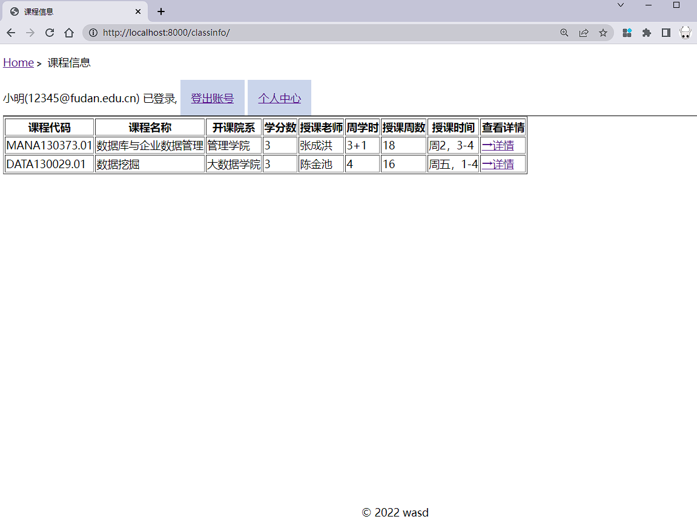
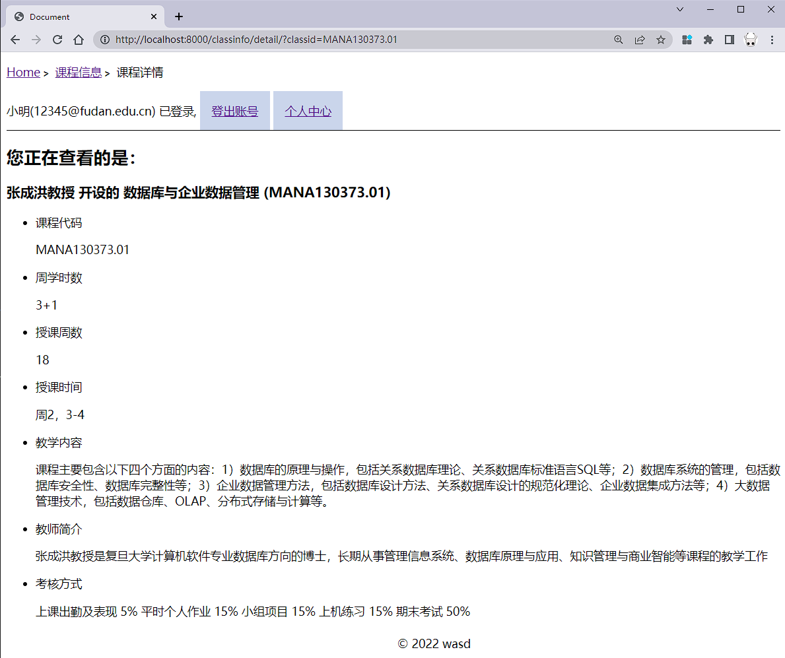

## 前置要求

本项目需要用[docker](https://www.docker.com/)来部署，在Windows系统下安装docker可以参考文章[Install On Windows](https://docs.docker.com/desktop/install/windows-install/)。

## 服务部署

### 1、配置文件修改（如有必要）

本项目的配置文件为[docker-compose.yml](./blob/main/docker-compose.yml)。

***需要特别注意*** 如果宿主机器上的**8000**或**3306**端口已经被占用，需要修改端口映射否则容器将无法运行。

举例来说，下面是配置文件中django的默认端口映射，它把容器的8000端口映射到宿主机器的8000端口

```yaml
ports:
  - 8000:8000
```

如有冲突，可以修改为：

```yaml
ports:
  - 8000:任意可用端口
```

### 2、容器运行

在项目文件夹打开终端，输入命令：

```sh
docker-compose up -d --build
```

即可构建并运行mysql和django服务器



可以在docker后台看到这两个容器的运行情况*<u>（由于mysql服务启动需要较长时间，在此期间django会不断报错并且重启，稍等片刻即可）</u>*：



### 3、数据导入

***等待两个容器都启动完毕后***，在mysql的terminal运行下面的命令导入数据：

```sh
# 修改配置文件为只读，否则mysql会忽视该文件
chmod 700  /etc/mysql/conf.d/my.cnf
# 使用sql脚本导入数据
mysql --user='root' --password='123456' --database='xk' < '/xk.sql'
```

看到下图即为数据导入成功：




## 页面介绍

### 时间操纵

出于演示需求，需要***手动调节*** 当前是学期的第几周，例如调节为第2周（以下语句需要连接数据库执行）：

```sql
UPDATE xk_models_week SET xk_models_week.week=2 WHERE xk_models_week.id=1;
```

### admin

django自带的管理员页面，可以登录超级用户来管理普通用户





超级用户的创建方式：

```
python manage.py createsuperuser
```


### 登陆页面



需要用指定的账号登录，未登录情况下访问域名下任何的地址都会重定向到这个页面

### 首页



包含站点导航和两个接口：登出、个人中心。

- 点击登出会清除登录的session信息，并且重新定向到登录页面。

### 个人中心

- 个人中心还没写，后续会写改密码等功能：



### 课程大纲查询



在此页面可以查看所有开设的课程

### 课程详情



点击详情按钮会跳转到详情页面，展示课程大纲的内容。