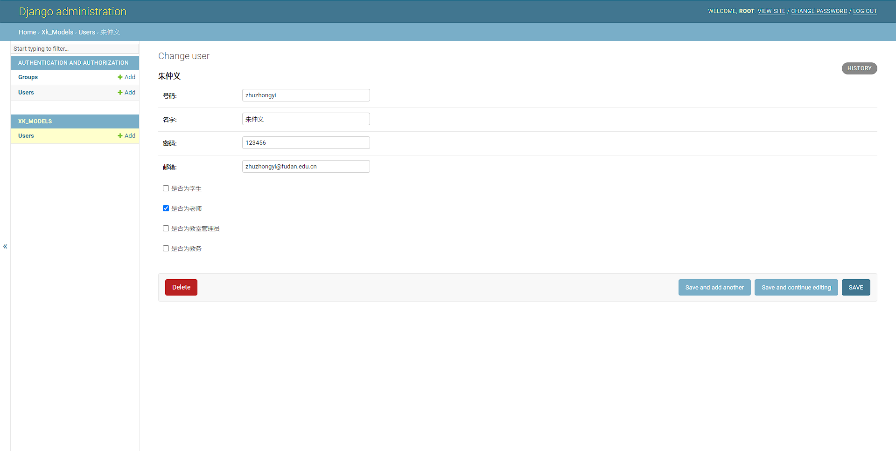
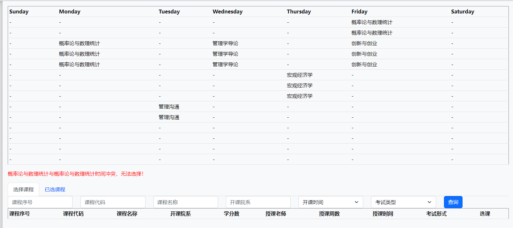
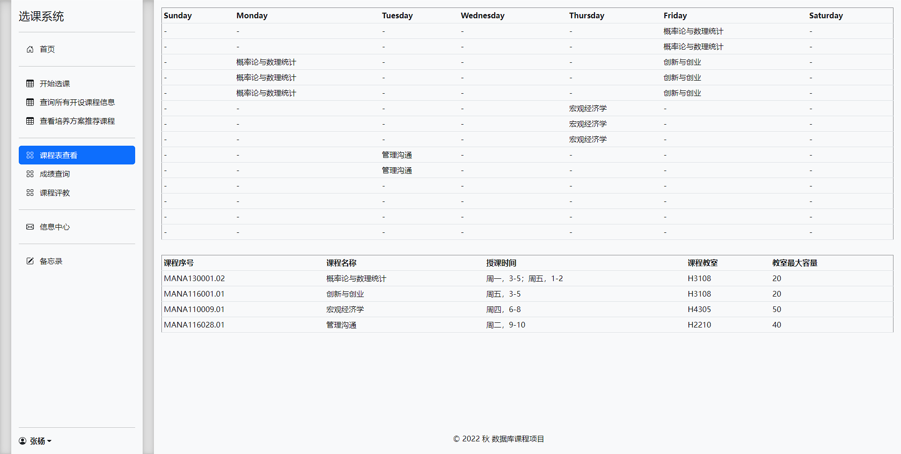

## 前置要求

本项目需要用[docker](https://www.docker.com/)来部署，在Windows系统下安装docker可以参考文章[Install On Windows](https://docs.docker.com/desktop/install/windows-install/)。

> 另外在Windows上运行docker容器还极有可能发生端口映射的问题，详见博文[Win10 Docker 启动报错端口占用](https://blog.csdn.net/qq12547345/article/details/119574373)，大概和HyperV以及WSL有关。
>
> 就我的经验来说每次遇到这个问题重启电脑，然后在电脑开启之后不要启动其他软件、而是直接打开docker就可以解决问题，希望对你有所帮助。

## 服务部署

### 1、配置文件修改（如有必要）

本项目的配置文件为[docker-compose.yml](./docker-compose.yml)。

***需要特别注意*** 如果宿主机器上的**8000**或**3306**端口已经被占用，需要修改端口映射否则容器将无法运行。

举例来说，下面是配置文件中django的默认端口映射，它把容器的8000端口映射到宿主机器的8000端口

```yaml
ports:
  - 8000:8000
```

如有冲突，可以修改为：

```yaml
ports:
  - 8000:任意可用端口
```

### 2、容器运行

在项目文件夹打开终端，输入命令：

```sh
docker-compose up -d --build
```

即可构建并运行mysql和django服务器


配置文件以及每个选项的解释贴在下面：

```yaml
# 配置文件的版本
version: "3.8"
# 服务器群
services:
  # 网页服务
  django:
    restart: always
    # 用当前文件夹的Dockerfile来构建
    build: .
    # 在数据库搭建完成之后启动
    depends_on:
      - mysql
    ports:
      - 8000:8000
    # 把当前文件夹映射为django的工作目录，从而达到本地修改同步到容器的效果
    volumes:
      - .:/xk
    # 运行命令
    command: sh -c "python3 manage.py makemigrations xk_models && python3 manage.py migrate && python3 manage.py runserver 0.0.0.0:8000"
  # 数据库服务
  mysql:
    # 使用最新的mysql镜像
    image: mysql
    # restart: always
    # 数据库的端口映射到本地3306
    ports:
     - 3306:3306
    environment:
      MYSQL_DATABASE : "xk"
      MYSQL_ROOT_PASSWORD : 123456
    command: --default-authentication-plugin=mysql_native_password
    volumes:
      # 数据文件
      - ./mysql/xk.sql:/xk.sql
      # 配置文件（默认文件编码存在问题
      # - ./mysql/conf.d:/etc/mysql/conf.d
```

等待docker build完成、启动容器后，就可以在docker后台看到这两个容器的运行情况*（由于mysql服务启动需要较长时间，在此期间django会不断报错并且重启，稍等片刻即可）*：


### 3、数据导入

***等待两个容器都启动完毕后***，在mysql容器的terminal运行下面的命令导入数据：

```sh
# 修改配置文件为只读，否则mysql会忽视该文件
chmod 700  /etc/mysql/conf.d/my.cnf
# 使用sql脚本导入数据
mysql --user='root' --password='123456' --database='xk' < '/xk.sql'
```

看到下图即为数据导入成功：


> 如果不修改配置文件则有可能出现编码问题（我们写好的utf8编码sql文件不能被正确地输入到sql服务器中），下图是修改前mysql的默认编码设置：
>
> ```sql
> -- 查询mysql的编码设置情况
> show variables like '%char%';
> ```
>
> 
>
> 
>
> 而通过修改配置文件即可解决编码问题，下图为修改后的编码设置：
>
> 
>
> 映射到`/etc/mysql/conf.d/my.cnf`的配置文件如下：
>
> ```
> [mysqld]
> character-set-server=utf8mb4 
> [client]
> default-character-set=utf8mb4
> [mysql]
> default-character-set=utf8mb4
> ```
>


### 4、容器销毁

运行

```sh
docker-compsoe down
```

即可关闭并删除之前创建的容器，数据并不会保存！


## 通用页面

### 1、时间操纵

出于演示需求，需要***手动调节*** 当前是学期的第几周，例如调节为第2周（以下语句需要连接数据库执行）：

```sql
UPDATE xk_models_week SET xk_models_week.week=2 WHERE xk_models_week.id=1;
```

并且由于前端的设计，每次修改完周数后需要**重新登录**才可以读取到正确的周数。

### 2、super user的创建

进行Django容器的terminal，在项目文件夹（默认为`/xk`）运行下面的命令，按照提示即可创建super user：

```sh
python3 manage.py createsuperuser
```

```text
/xk # python3 manage.py createsuperuser
Username (leave blank to use 'root'): root
Email address: 
Password: 
Password (again): 
This password is too short. It must contain at least 8 characters.
This password is too common.
This password is entirely numeric.
Bypass password validation and create user anyway? [y/N]: y
Superuser created successfully.
/xk #
```

我创建了用户名为`root`密码为`123`的super user.

### 3、admin页面

> 网址为http://localhost:8000/admin

登录刚才创建的super user账户


管理选课系统的用户：




当然，我们也可以直接连接mysql在数据库中直接改动这些用户的信息。

### 4、登陆页面

> 网址为http://localhost:8000/login

特性介绍：

- **【账号管理】**需要用指定的账号登录，账号无法公开注册只能由管理员添加。
- **【登录保护】**未登录情况下访问域名下任何的地址都会重定向到这个页面。
- **【页面样式】**使用了复旦统一身份认证的CSS样式文件。
- **【DjangoForm】**表单是利用Django的Form构建的，有一定的验证功能，并且登陆失败也会有相应的提示。
- **【通知公告】**右侧有一栏通知栏，会通告邮箱封禁情况以及解答常见的疑问。
  - **但是我们并没有去写这些页面的具体信息，而是引用了复旦的相关链接充数**
- **【找回密码】**这个功能暂未完成，如果点击会进入404页面。

初次访问：


表单验证：


错误提示：


点击找回密码：


## 学生身份登录

> 用账号：19307100027@fudan.edu.cn 密码：123456 来演示

我们做了相关的验证：如果登录了学生页面，试图访问老师的一些页面，会提示访问限制：


### 1、首页

> 网址为http://localhost:8000/index

特性介绍：

- **【侧边栏】**：常驻的侧边栏，会高亮显示当前所在的板块。
- **【弱密码警告】**：如果密码较弱（例如默认的123456），则会进行相应的提示，提示可以关闭。
  - 但是我们并没有写很高深的算法来检验密码的复杂性，只是判断是否含有片段`12345`
- **【备忘录】**：点击即可在右边打开一个悬浮组件，可以方便进行选课时记录课程号等。
- **【账号管理】**：右下角为折叠菜单，点击可以看到**个人中心**以及**登出按钮**。

初见：


高亮显示侧边栏：


账号管理：


备忘录用法、功能演示：


### 2、选课页面

> 网址为http://localhost:8000/classchoice/，需要修改当前周数为1-3才可以选课。

特性介绍：

- 【筛选功能】：我们在页面上实现了多种筛选方法，


- 【课程冲突检测】



- 【已选课程一览】：点击详情可以查看该课程的详细信息


### 3、课程详细信息

>  网址为http://localhost:8000/classinfo/


点击详情可以查看课程的详细信息：


### 4、培养方案推荐

> http://localhost:8000/program/

页面会显示培养方案推荐修读但是当前用户并未修读过或者已经选课的课程：


### 5、课程表

> http://localhost:8000/classtable/



### 6、成绩查询

> http://localhost:8000/score/

在老师学期末提交成绩后会有相关的显示


### 7、评教

> http://localhost:8000/evaluation/，只有学期末（周数大于10）开放


点击评教按钮后会有对话框弹出：


如果超出字数限制则会提交失败：


### 8、信息中心

> http://localhost:8000/message/

会显示来自老师、教务系统等等人员发来的通知，例如学期末的成绩通知。


### 10、备忘录

此略

### 11、个人中心

> http://localhost:8000/me/


如果点击修改密码会跳转到404页面：


## 教师身份登录

> 用账号：1234567@fudan.edu.cn，密码：12345 来演示

### 1、首页

> http://localhost:8000/teacher_index/


### 2、调课申请

> http://localhost:8000/class_adj/


调课页面：

- 可以通过筛选查询可以调课的时间：


- 如果有学生存在课程冲突、调课目标不合理等则不允许调课


申请历史：


### 3、开课申请

> http://localhost:8000/class_open/

需要填写表单：


提交完申请后可以在申请记录中查看：


### 4、授课课表

> http://localhost:8000/teach_table/


### 5、成绩发布

> http://localhost:8000/grade_mission/

未完成的页面：


课程成绩输入页面：


提交完之后会进入审核中的状态，等待教务人员审核完毕：


### 6、评教查询

> http://localhost:8000/evaluation_view/


### 7、其他页面和学生类似，不再赘述

## 教务老师身份登录

> 用账号：fdsm@fudan.edu.cn，密码：123456 来演示

### 1、开课审核

> http://localhost:8000/class_audit/

列表：


详情页面：

驳回需要填写表单：


如果接受需要提交排课时间：

（实际上这个工作应该由系统来完成，但是我们实在是力不从心）


### 2、成绩审核

> http://localhost:8000/grade_audit/


### 3、课程查询

> http://localhost:8000/class_view/


### 4、培养方案更新

> http://localhost:8000/program_update/


### 5、信息中心

> http://localhost:8000/message/


### 6、其他页面与上面相同，不再赘述